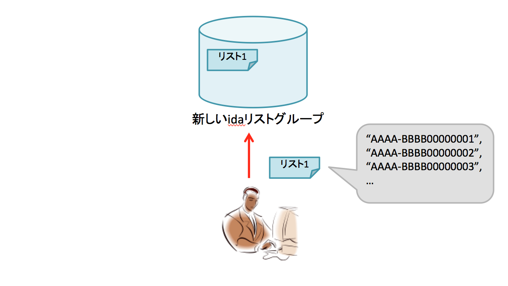
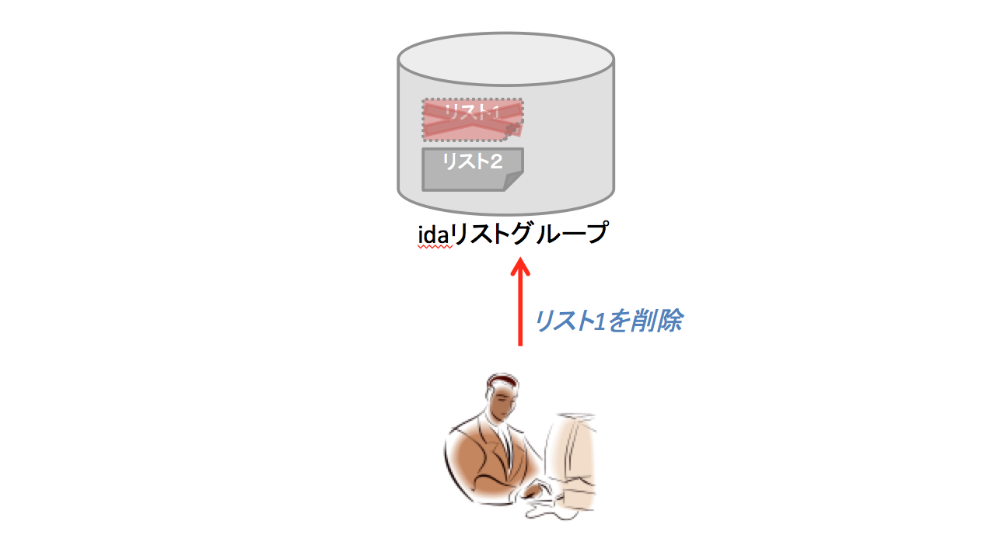

# Zucks Ad Network 代理店向けIDFA/AdID リストアップロード API 仕様書 v2.0

リリース日: 2015/12/14

## 概要

Zucks AdNetwork の配信でターゲティングとして利用したい IDFA/Android advertising ID (以下 ida) のリストをアップロードするためのAPIです。

キャンペーンではidaリストグループを設定し、グループに対してidaリストの追加や削除を行うことで、IDFAターゲティングの調整を行うことができます．


Zucks AdNetwork では以下のAPIを提供します。


* [idaリストとidaリストグループの新規作成](#create-ida-list-and-ida-list-group)
* [idaリストグループの新規作成](#create-ida-list-group)
* [idaリストグループのステータス確認](#show-ida-list-group)
* [idaリストグループにidaリストを追加](#add-ida-list-to-ida-list-group)
* [idaリストグループからidaリストを削除](#remove-ida-list-from-ida-list-group)


----


## 準備

* Zucks AdNetwork idaリスト用 APIキー
  * 代理店管理画面のAPIキーメニューから発行ができます

## 全ての機能で共通の仕様

##### URL

      https://ms.zucksadnetwork.com/app.php/web_api/ida/v2/

から始まるURLになります。

##### 認証

* 管理画面で確認できる idaリスト用 APIキーをリクエストヘッダに使った認証

##### リクエスト例

    curl  -X POST <URL> -H "x-api-key:${API_KEY}" -d '<PAYLOAD>'

##### PAYLOAD形式

リクエストのPAYLOADはJSON(UTF-8)の形式で送信してください。

##### レスポンス形式

レスポンスのコンテンツはJSONで返却されます。

また、マルチバイト文字はUnicodeエスケープシーケンスの形式で返却されますが、以降のレスポンス例では 便宜上デコード後のマルチバイト文字を記載しています。

##### 処理失敗時のレスポンス

処理失敗時は必ず400以上のステータスコードでレスポンスを返します。


----

### <a name="create-ida-list-and-ida-list-group"> idaリストとidaリストグループの新規作成

idaリストとidaリストグループを作成します



idaリストグループは、配信設定で指定することで配信時のターゲティングとして利用されるもので、1つもしくは複数のidaリストを紐付けて使用します。

##### URL

    https://ms.zucksadnetwork.com/app.php/web_api/ida/v2/groups

##### リクエストメソッド

POST

##### PAYLOAD

* advertiser_id: idaリストを利用する広告主ID(管理画面から確認できます) (必須)
* name: idaリストグループの名前 (必須/120文字以内)
* list_name: idaリストの名前(省略可/120文字以内) 省略した場合は自動で名前が付けられます。
* list_ida: IDFA/AdIDの配列(必須)

一度にアップロードできるidaの件数は、最大50万件となっております。
50万件を超えるターゲティングを行う場合は、50万件以下に分割して複数のidaリストを用意し、後述のidaリスト追加機能を使用してください。


```json
{
  "advertiser_id": 10324,
  "name": "10日起動していないユーザー",
  "list_name": "10日起動していないユーザー_2015-11-01",
  "list_ida": ["aaaaaaaa-bbbb-cccc-1111-222222220000","aaaaaaaa-bbbb-cccc-1111-222222220001"]
}
```

##### レスポンス

アップロードが成功したかどうかはHTTPのレスポンスのステータスコードが200かどうかで確認できます。
空文字列の場合はその文字列は取り込まずスキップします。

##### ステータスコード

 * 200: 正常に終了
 * 400: データのバリデーションエラーなどの場合
 * 401: 認証に失敗した場合

##### レスポンス内容

* 成功した場合
  * request_at: APIをリクエストされた日時
  * type: "ida_list_group" が固定で入ります
  * id: 作成されたidaリストグループID。
  * name: グループ名
  * created_at: グループを作成した日時
  * advertiser: このidaリストを使用できる広告主情報
    * type: "advertiser" 固定
    * id: 広告主ID
  * lists: グループに所属するidaリストの配列
    * type: "ida_list" が固定で入ります
    * id: idaリストID
    * name: idaリスト名
    * status: idaリストの取り込み状況
      * "ready": idaリストのシステムへの取り込みが完了し、ターゲティングとして利用可能な状態
      * "queued": システムへの取り込み処理中の状態。
    * success_count: 取り込みに成功した件数（取り込みが完了している場合のみ、返します）
    * failure_count: 取り込みに失敗した件数（取り込みが完了している場合のみ、返します）
    * expired_at: リストの有効最終日時
    * created_at: リストを作成した日時

```json
{
  "request_at": "2015-05-01T12:00:00+0900",
  "type": "ida_list_group",
  "id": 1,
  "name": "10日起動していないユーザー",
  "created_at": "2015-04-01T12:00:00+0900",
  "advertiser": {
    "type": "advertiser",
    "id": 100
  },
  "lists": [
    {
      "type": "ida_list",
      "id": 1,
      "name": "10日起動していないユーザー_2015-11-01",
      "status": "queued",
      "created_at": "2015-04-01T12:00:00+0900",
      "expired_at": "2015-06-01T12:00:00+0900"
    }
  ]
}
```

 * 失敗した場合

```json
{
  "error": ["Requested advertiser_id parameter is invalid. Reconfirm advertiser_id parameter."],
  "request_at": "2015-05-01T12:00:00+0900"
}
```

---

### <a name="create-ida-list-group"> idaリストグループの新規作成

idaリストグループを作成します

idaリストが未登録の空のidaリストグループであるため、実際にターゲティングで使用するためには[idaリストグループにidaリストを追加](#add-ida-list-to-ida-list-group)のAPIを使用してidaリストを追加する必要があります。(参考:[FAQ](#faq))

##### URL

    https://ms.zucksadnetwork.com/app.php/web_api/ida/v2/groups/create

##### リクエストメソッド

POST

##### PAYLOAD

* advertiser_id: idaリストを利用する広告主ID(管理画面から確認できます) (必須)
* name: idaリストグループの名前 (必須/120文字以内)

```json
{
  "advertiser_id": 10324,
  "name": "10日起動していないユーザー"
}
```

##### レスポンス

作成したidaリストグループの情報を返します

##### ステータスコード

 * 200: 正常に終了
 * 400: データのバリデーションエラーなどの場合
 * 401: 認証に失敗した場合

##### レスポンス内容

* 成功した場合
  * request_at: APIをリクエストされた日時
  * type: "ida_list_group" が固定で入ります
  * id: 作成されたidaリストグループID。
  * name: グループ名
  * created_at: グループを作成した日時
  * advertiser: このidaリストを使用できる広告主情報
    * type: "advertiser" 固定
    * id: 広告主ID
  * lists: グループに所属するidaリストの配列
    * idaリストは未登録のためから配列になります

```json
{
  "request_at": "2015-05-01T12:00:00+0900",
  "type": "ida_list_group",
  "id": 1,
  "name": "10日起動していないユーザー",
  "created_at": "2015-04-01T12:00:00+0900",
  "advertiser": {
    "type": "advertiser",
    "id": 100
  },
  "lists": []
}
```

 * 失敗した場合

```json
{
  "error": ["Requested advertiser_id parameter is invalid. Reconfirm advertiser_id parameter."],
  "request_at": "2015-05-01T12:00:00+0900"
}
```

---

### <a name="show-ida-list-group"> idaリストグループのステータス確認

作成したidaリストグループの状態を返却します。
アップロードしたidaリストの情報を確認することができます。

##### URL

    https://ms.zucksadnetwork.com/app.php/web_api/ida/v2/groups/{list_group_id}

  * `{list_group_id}`: 対象のidaリストグループID。IDはグループ作成時のレスポンスから取得することができます。

##### リクエストメソッド

GET

##### PAYLOAD

なし

##### レスポンス HTTPステータス

リクエストが成功したかどうかはHTTPのレスポンスのステータスコードが200かどうかで確認できます。

* 200: 正常に終了
* 401: 認証に失敗した場合
* 404: IDに対応するidaリストが見つからない場合

##### レスポンス内容

* 成功した場合
  * request_at: APIをリクエストされた日時
  * type: "ida_list_group" が固定で入ります
  * id: idaリストグループID
  * name: グループ名
  * created_at: グループを作成した日時
  * advertiser: このidaリストを使用できる広告主情報
    * type: "advertiser" 固定
    * id: 広告主ID
  * lists: グループに所属するidaリストの配列
    * type: "ida_list" が固定で入ります
    * id: idaリストID
    * name: idaリスト名
    * status: idaリストの取り込み状況
      * "ready": idaリストのシステムへの取り込みが完了し、ターゲティングとして利用可能な状態
      * "queued": システムへの取り込み処理中の状態。
    * success_count: 取り込みに成功した件数（取り込みが完了している場合のみ、返します）
    * failure_count: 取り込みに失敗した件数（取り込みが完了している場合のみ、返します）
    * expired_at: リストの有効最終日時
    * created_at: リストを作成した日時

```json
{
  "request_at": "2015-05-01T12:00:00+0900",
  "type": "ida_list_group",
  "id": 1,
  "name": "10日起動していないユーザー",
  "created_at": "2015-04-01T12:00:00+0900",
  "advertiser": {
    "type": "advertiser",
    "id": 100
  },
  "lists": [
    {
      "type": "ida_list",
      "id": 1,
      "name": "10日起動していないユーザー_2015-11-01",
      "status": "ready",
      "success_count": 990,
      "failure_count": 10,
      "created_at": "2015-04-01T12:00:00+0900",
      "expired_at": "2015-06-01T12:00:00+0900"
    },
    {
      "type": "ida_list",
      "id": 2,
      "name": "10日起動していないユーザー_2015-11-02",
      "status": "queued",
      "created_at": "2015-04-01T12:00:00+0900",
      "expired_at": "2015-06-01T12:00:00+0900"
    }
  ]
}
```

----

### <a name="add-ida-list-to-ida-list-group"> idaリストグループにidaリストを追加

すでに作られたidaリストグループに、idaリストを追加します。


##### URL

    https://ms.zucksadnetwork.com/app.php/web_api/ida/v2/groups/{list_group_id}/lists

  * `{list_group_id}`: 対象のidaリストグループID

##### リクエストメソッド

POST

##### PAYLOAD

* list_name: idaリストの名前(必須/120文字以内)
* list_ida: IDFA/AdIDの配列(必須)

```json
{
  "list_name": "10日起動していないユーザー_2015-11-01",
  "list_ida": ["aaaaaaaa-bbbb-cccc-1111-222222220000","aaaaaaaa-bbbb-cccc-1111-222222220001"]
}
```

#### レスポンス

正常に処理できた時のみ、ステータスコード200でレスポンスを返します。

#### レスポンス内容

正常完了時は、リクエスト時刻のみを返却します。
紐付けられた結果の状態を確認したい場合は、別途確認APIを使用してください。

```json
{
  "request_at": "2015-05-01T12:00:00+0900"
}
```

----

### <a name="remove-ida-list-from-ida-list-group"> idaリストグループからidaリストを削除

idaリストグループから、idaリストを削除します。
（注意）idaリストグループにidaリストが１つしかない場合は削除することはできません。



##### URL

    https://ms.zucksadnetwork.com/app.php/web_api/ida/v2/groups/{list_group_id}/lists/{list_id}

  * `{list_group_id}`: 対象のidaリストグループID
  * `{list_id}`: 対象のidaリストID

##### リクエストメソッド

DELETE

##### PAYLOAD

なし

#### レスポンス

正常に処理できた時のみ、ステータスコード200でレスポンスを返します。

#### レスポンス内容

正常完了時は、リクエスト時刻のみを返却します。
紐付け解除後の結果の状態を確認したい場合は、別途確認APIを使用してください。

```json
{
  "request_at": "2015-05-01T12:00:00+0900"
}
```

## <a name="faq"> FAQ

##### 空のidaリスト、idaリストグループを広告配信のターゲティングで使用した場合どうなるか

ターゲティングするセグメントが空となります。
リターゲティング案件の場合はリタゲ対象なしと判断され広告は配信されません。
デリタゲ案件の場合はデリタゲ対象なしと判断され全体に配信されますので空のidaリスト、idaリストグループの使用に注意してください。
  
