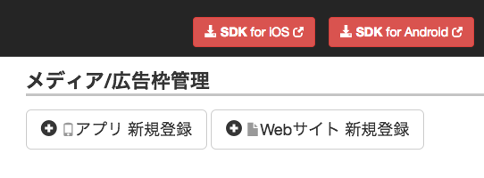
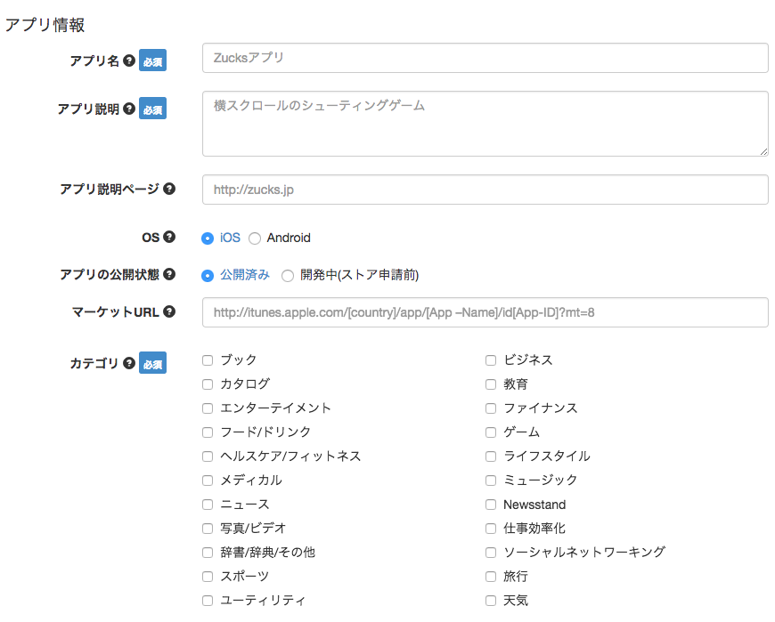
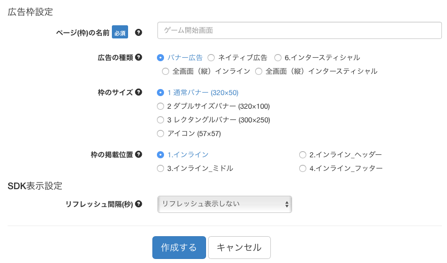
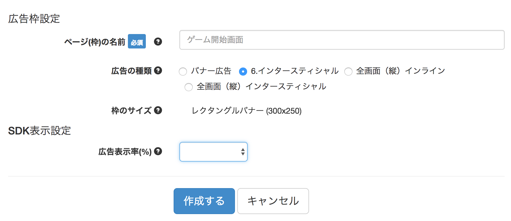
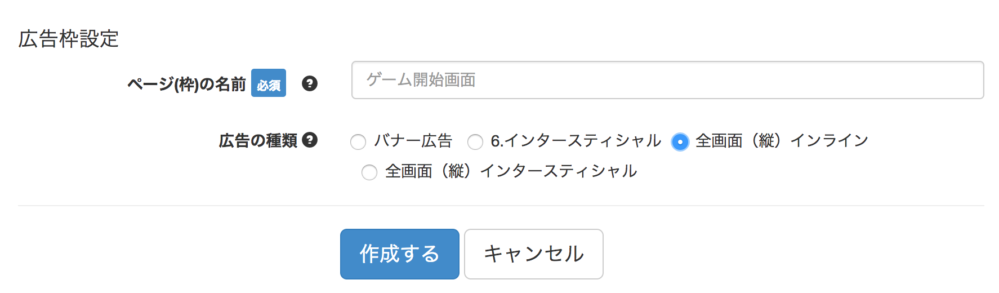
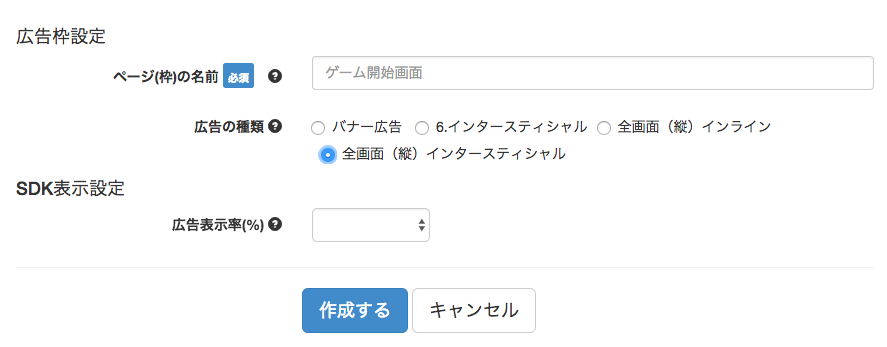
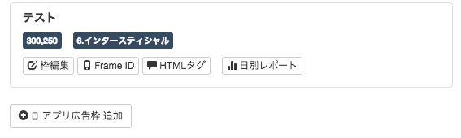
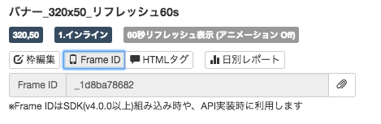

# ZucksAdNetwork Creating Ad Units

## Overview

Describes the steps to create Ad Unit on the Zucks Ad Network dashboard.  
<a href="https://ms.zucksadnetwork.com/media/admin/#/login" target="_blank">Zucks Ad Network dashboard</a>

- Create new application
    - Register application information
- Create Ad Unit
    - Banner
    - Interstitial
    - Inline(Fullscreen)
    - Interstitial(Fullscreen)

## How to create Ad Units

### Create Application

Select the `メディア/広告枠管理` menu and create an application from the `アプリ新規登録` button.  
(If already created, go to the [Create Ad Unit](#register-ad-unit) step)

### Register application information

- `アプリ名` ※required : Enter the name of the application
- `アプリ説明` ※required : Enter a summary of the application
- `アプリ説明ページ` : Enter application description page URL
- `OS` : Select the platform of the application
- `アプリの公開状態` : Select the application's publishing status
    - Select `公開済み` if it has already been published to the store and `開発中(ストア申請前)` in the case of not being published
- `マーケットURL` : If the application has already been published to the store, enter the URL
- `カテゴリ` ※required : Set category of application
    - Refer to the category list below

#### iOS category

| display            | description     |
|:-------------------|:----------------|
|ブック               |Book              |
|ビジネス              |Business         |
|カタログ              |Catalogs         |
|教育                 |Education         |
|エンターテイメント       |Entertainment    |
|ファイナンス           |Finance           |
|フード／ドリンク        |Food & Drink      |
|ゲーム                |Games            |
|ヘルスケア/フィットネス   |Health & Fitness |
|ライフスタイル          |Lifestyle        |
|メディカル             |Medical           |
|ミュージック           |Music             |
|ナビゲーション          |Navigation        |
|ニュース              |News              |
|Newsstand           |Newsstand         |
|写真/ビデオ            |Photo & Video     |
|仕事効率化             |Productivity      |
|辞書/辞典/その他        |Reference         |
|ソーシャルネットワーキング |Social Networking |
|スポーツ              |Sports            |
|旅行                 |Travel            |
|ユーティリティ          |Utilities        |
|天気                 |Weather           |

#### Android category

| display            | description            |
|:-------------------|:-----------------------|
|書籍＆文献            | Books & Reference       |
|ビジネス              | Business               |
|コミック              | Comics                 |
|通信                 | Communications         |
|教育                 | Education              |
|エンターテイメント      | Entertainment           |
|金融                 | Finance                |
|健康＆フィットネス      | Health & Fitness        |
|ライブラリ＆デモ        | Libraries & Demo       |
|ライフスタイル         | Lifestyle               |
|ライブ壁紙            | Live Wallpapers         |
|メディア＆動画         | Video Players & Editors |
|医療                 | Medical                |
|音楽＆オーディオ        | Music & Audio          |
|ニュース＆雑誌         | News & Magazines        |
|カスタマイズ           | Personalization        |
|写真                 | Photography            |
|ショッピング           | Shopping               |
|ソーシャル            | Social                  |
|スポーツ              | Sports                 |
|ツール               | Tools                   |
|交通                 | Maps & Navigation      |
|旅行＆地域            | Travel & Local          |
|天気                 | Weather                |
|ウィジェット          | widget                  |
|ゲーム               | Games                   |

### Register Ad Unit

#### Banner

- ※required : Set the name of the frame to `ページ(枠)の名前` (This is the frame name displayed on the report)
- Select `バナー広告` from `広告の種類`
- Choose the size of the ad from `枠のサイズ`
- Set `インライン` to `枠の掲載位置`
- Set the refresh interval (seconds) of the ad to `リフレッシュ間隔(秒)`
- Click the `作成する` button to create ad unit

#### Interstitial

- ※required : Set the name of the frame to `ページ(枠)の名前` (This is the frame name displayed on the report)
- Select `インタースティシャル` from `広告の種類`
- Set the frequency with which ads are shown in `広告表示率(%)`
    - If it is set to 50%, it will be displayed with 1/2 probability
- Click the `作成する` button to create ad unit

#### Inline(Fullscreen)

- ※required : Set the name of the frame to `ページ(枠)の名前` (This is the frame name displayed on the report)
- Select `全画面(縦)インライン` from `広告の種類`
- Click the `作成する` button to create ad unit

#### Interstitial(Fullscreen)

- ※required : Set the name of the frame to `ページ(枠)の名前` (This is the frame name displayed on the report)
- Select `全画面(縦)インタースティシャル` from `広告の種類`
- Set the frequency with which ads are shown in `広告表示率(%)`
    - If it is set to 50%, it will be displayed with 1/2 probability
- Click the `作成する` button to create ad unit

### Adding Ad Unit

When adding ad unit to registered application, create it from the `アプリ広告枠追加` button in the `広告表示枠` column.

### Find the FrameID

When you press the `FrameID` button of the created ad unit, FrameID is displayed.

※ When used as mediation, setting of the banner refresh interval and interstitial advertisement display rate on the Zucks dashboard is ignore.

