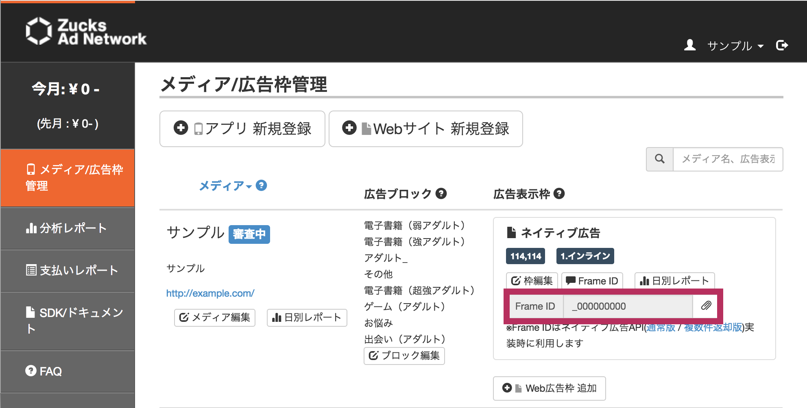

# Zucks Ad Network Native Ad Template

## 概要

[Zucks Ad Networkのネイティブ広告API](https://github.com/zucks/ZucksAdNetworkDocuments/blob/master/webapi/Zucks-Ad-Network-Native-api-specification-v2.md)を利用して、クライアントサイトのHTML上でJavaScriptを使用しネイティブ広告を表示するサンプルコードです。

このサンプルコードを参考に、メディアに合わせて構造(HTML)や見た目(CSS)をカスタマイズしご利用ください。

より柔軟な広告表示制御が必要な場合は、このテンプレートを利用せずに、サーバーサイドでネイティブ広告APIを利用した処理を実装してください。


## 免責事項

当社が提供しているZucks Ad Network Native Ad Templatのスクリプト、スタイルシートについての免責事項です。

* 複製・改変は自由です。改変する際は[ネイティブ広告APIの仕様書](https://github.com/zucks/ZucksAdNetworkDocuments/blob/master/webapi/Zucks-Ad-Network-Native-api-specification-v2.md)をご確認の上、行ってください。
* スクリプト・スタイルシートは挙動をご確認の上、ご自身の責任のもとにご使用ください。


## 制限事項

* 114x114の画像サイズのネイティブ広告のみ
* サポートしているブラウザ　
    * iOS9以上のSafari
        * iOS8以前のSafariの場合、広告は表示されません
    * Android4以上のChrome
* `リンクボタン設置時のテキスト` は未サポート
* 1ページに1枠のみ
    * 複数タグを同一ページに設置することはできますが、その場合同じ広告が出る可能性があります
* 本文、商品名、広告主名が長い場合、文章の一部が省略されることがあります
    * 文章を省略するかどうかの制御はスタイルシートで行っています  
      省略したくない場合はスタイルシートを編集してください
* スクリプトファイルとスタイルシートのファイルは、ご自身の管理するWEBサーバーにアップロードし管理してください


## 事前準備

1. [スクリプト](https://ms.zucksadnetwork.com/media/native/template/native-114x114-01.js)と[スタイルシート](https://ms.zucksadnetwork.com/media/native/template/native-114x114-01.css)をダウンロードしてください

2. 必要であれば、スクリプト内のHTMLとスタイルシートを修正してください

3. スクリプトとスタイルシートをご自身の管理するWEBサーバにアップロードしてください


## 利用方法

### サイトのHTMLに直接タグを埋め込む

`<head>` 内でスクリプトとスタイルシートを読み込んでください

```html
<link href="{スタイルシートのURL}" type="text/css" rel="stylesheet">
<script src="{スクリプトのURL}" type="application/javascript" async></script>
```

広告を出したい箇所に広告タグを設置してください

* `{ZucksFrameID}` は管理画面の広告表示枠に記載されている `Frame ID` の値です

    


* `{広告表記}` は広告であることを表す内容を指定してください  
    デフォルトは `[PR]` が表示されます
    * ex. `[PR]` `[sponsored]` `[広告]`

```html
<ins data-zucks-frame-id="{ZucksFrameID}" data-disclosure-label="{広告表記}"></ins>
<script>
  (adsbyzucks = (window.adsbyzucks || [])).push({});
</script>
```

#### デモ

* [Plnkr](http://embed.plnkr.co/rwg9gry03ADK6PljJfXd/)
* [サンプル](https://ms.zucksadnetwork.com/media/native/template/114x114.html)


### 外部システムにタグで入稿する場合


以下のタグを直接タグを埋め込む場合と同様に修正し、入稿してください

* スタイルは320x50の枠に合うように調整しています
* 320x50以外の枠サイズに出したい場合はスタイルシートを修正してください

```html
<link href="{スタイルシートのURL}" type="text/css" rel="stylesheet">
<script src="{スクリプトのURL}" type="application/javascript" async></script>
<ins data-zucks-frame-id="{ZucksframeID}" data-disclosure-label="{広告表記}"></ins>
<script>
  (adsbyzucks = (window.adsbyzucks || [])).push({});
</script>
```
