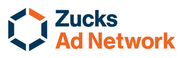
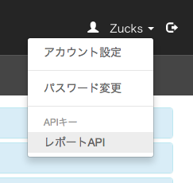

# メディアパートナー様向け レポートAPI 仕様書

## バージョン

`1.0`

## はじめに
本ドキュメントでは、Zucks Ad Networkがメディアパートナー様向けに提供するレポートAPI（以下、本API）についてご説明します。本APIは、管理画面(※1)上でご確認いただける各種レポートを、プログラマティックに取得いただける機能を提供します。

### 概要

#### 認証方式について
本APIをご利用いただく際には、事前にメディアパートナー様が管理画面上でAPIキーを発行していただき、これをリクエストヘッダに送付していただきます。

#### レスポンスについて
レスポンスのフォーマットはCSVで、文字コードはUTF-8です。

#### リクエスト制限について
制限時間あたりのリクエスト回数に上限がございます。上限を超えてリクエストが発生した場合、HTTPステータス `429(Too Many Connections)` を返す場合がございます。

#### 当日分のレポートについて
レポートは毎時バッチ処理で集計されているため、当日分のレポートを取得される場合は、その時点でレポーティング可能な値を返します。
一日分の数値は、翌朝には集計が完了し、数値が取得できるようになります。

### APIキーについて

APIキーが漏えいした場合、悪意ある第三者に意図せず利用される可能性がありますので、厳重に管理してください。また、自らの意思で第三者に開示する場合には、ご自身の責任の元で行なってください。

また、APIキーが悪意ある第三者に渡った可能性のある場合には、すみやかに削除または再発行してください。

#### 発行・操作方法
APIキーは管理画面上から発行・再発行・削除できます。

### 利用方法
リクエストヘッダ `X-API-KEY` に、発行したAPIキーをご指定ください。以下に `curl` を用いたリクエスト例を示します。

~~~sh
$ curl -s -H 'X-API-KEY: 21ba4e3r-1131-8823-81as-1lk343je218e' 'https://ms.zucksadnetwork.com/web_api/media/report/frame/daily?start=2016-07-01&end=2016-07-02'
~~~

### エラーについて
APIキーが指定されていない場合や、不正なAPIキーが指定された場合、HTTPステータス `401(Unauthorized)` でレスポンスが返却されます。

一部のケースでレスポンス本文がCSV形式とならない可能性がありますので、ステータスコードで正常／異常の判断をしてください。

以下はエラーの一例です。

~~~sh
$ curl -sk --compressed -H 'X-API-KEY; 36cfbea5-7ee0-48d7-8a49-69d33d32c4c2' 'https://ms.zucksadnetwork.com/web_api/media/report/frame/daily?start=2016-07-01&end=2016-07-02' -w "%{http_code}"
result
"No API key specified"
401
~~~

### サービス規約

最新のサービス規約は以下のURLでご確認いただけます。
https://ms.zucksadnetwork.com/media/terms.html

## API 詳細

### 1. 枠分析レポート（日別）
アカウントに登録されている、全メディアおよびそれらの枠の、日毎レポートを返します。レポートの形式は、指定された期間の各日、メディア、枠ごとに行が分かれた形になります。

#### エントリポイント
~~~
https://ms.zucksadnetwork.com/web_api/media/report/frame/daily.csv
~~~

#### パラメータ

| 名前 | 型 | 説明 | 例 |
|---|---|---|---|
| start | 文字列 | レポート期間の開始日 | "2016-08-01" |
| end | 文字列 | レポート期間の終了日（含む） | "2016-08-02" |

#### レスポンス

| 名前 | 型 | 説明 | 例 |
|---|---|---|---|
| medium_id | 整数 | メディアID | 123 |
| medium_name | 文字列 | メディア名 | "サンプルメディア" |
| frame_id | 整数 | 枠ID | 12345 |
| frame_name | 文字列 | 枠名 | "起動時レクタングル枠" |
| date | 文字列(年月日) | レポート日 | "2016-08-01" |
| imp | 整数 | インプレッション数 | 123456 |
| click | 整数 | クリック数 | 123456 |
| payout | 整数 | 売上額 | 4936 |
| cpc | 浮動小数点型 | CPC | 4.97 |
| ctr | 浮動小数点型 | CTR | 0.42 |
| ecpm | 浮動小数点型 | eCPM | 20.97 |

#### エラー

| ステータス | メッセージ | 説明 |
|---|---|---|
| 400 | No Media registered yet | アカウントにメディアが登録されていない場合に発生します |

#### 更新頻度
レポートの最短更新頻度は1時間に1回です。 数値の適正化などのため、再更新の際には数値が変動する可能性があります。丸一日のレポートを取得される場合は、翌日の朝に取得されることをお勧めします。

リクエストサンプル

~~~
$ curl -s --compressed -H 'X-API-KEY: 21ba4e3r-1131-8823-81as-1lk343je218e' 'https://ms.zucksadnetwork.com/web_api/media/report/frame/daily.csv?start=2016-07-01&end=2016-07-02'
medium_id,medium_name,frame_id,frame_name,date,imp,click,payout,cpc,ctr,ecpm
1,"メディアA",100,"枠A-A","2016-07-01",123456,1234,4936,4.97,0.42,20.97
1,"メディアA",100,"枠A-A","2016-07-02",123456,1234,4936,4.97,0.42,20.97
1,"メディアA",101,"枠A-B","2016-07-01",123456,1234,4936,4.97,0.42,20.97
1,"メディアA",101,"枠A-B","2016-07-02",123456,1234,4936,4.97,0.42,20.97
2,"メディアB",102,"枠B-A","2016-07-01",123456,1234,4936,4.97,0.42,20.97
2,"メディアB",102,"枠B-A","2016-07-02",123456,1234,4936,4.97,0.42,20.97
~~~

## 補足

#### frame_id
frame_idは管理画面上で「Frame ID」として表示されているものに当たります。

#### frame_name
frame_nameは管理画面上で「ページ(枠)の名前」として表示されているものに当たります。

#### 収益額
収益額は税込金額です。税額計算の粒度がメディア毎か枠毎かなどによって、誤差が生じる場合があります。確定金額は管理画面上の「支払いレポート」をご参照ください。

## 注釈

※1. 管理画面  https://ms.zucksadnetwork.com/media/admin/

