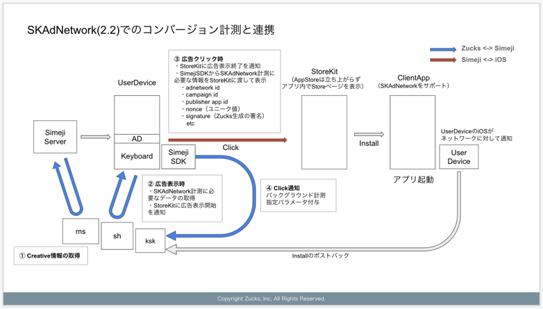

# Zucks Search Ad API for simeji supporting SKAdNetwork 2.2

_We propose both the StoreKit-Rendered Ad and the View-Through Ad for the future reference. You can only use the
View-Through Ad._

## Overview figure



## Prerequisites

- Include the Zucks network’s ID in your Info.plist
    - Zucks ad network’s ID: `3qcr597p9d.skadnetwork`
    - https://developer.apple.com/documentation/storekit/skadnetwork/configuring_the_participating_apps

## SKAdNetwork measurement

### Flow chart


### ① Campaign API

- API
    - ENDPOINT: https://ms.zucksadnetwork.com/web_api/search_ad/simeji/v2
    - METHOD: GET
    - Example:
      ```
      curl -H 'x-api-key:xxxxxxxxxxxxxxxx' 'https://ms.zucksadnetwork.com/web_api/search_ad/simeji/v2?frame_id=xxxxxx'
      ```
    - You could reuse the x-api-key from the previous version.
- If a campaign supports SKAdNetwork, the field **skadnSignatureUrl** will be added to the response of campaign which
  supported SKAdNetwork.
    - For Android or campaigns that do not support SKAdNetwork this field will not exist.
- Instructions on how to use this field would be written below.

#### Example

```json
{
  "result": [
    {
      "id": 1,
      "appId": "com.example.AndroidApp",
      "appName": "Zucks Android App",
      "os": "android",
      "osMinVersion": "5.1",
      "osMaxVersion": "9.3.5",
      "cpc": 10.5,
      "impUrl": "https://k.zucks.net/i/?x=...",
      "clickUrl": "https://k.zucks.net/rd/?x=..."
    },
    {
      "id": 90,
      "appId": "727497959",
      "appName": "Zucks IOS App",
      "os": "ios",
      "cpc": 20,
      "impUrl": "https://k.zucks.net/i/?x=...",
      "clickUrl": "https://k.zucks.net/rd/?x=...",
      "skadnSignatureUrl": "https://sh.zucks.net/search_ad/skadn/?x=..."
    }
  ]
}
```

### ② Call skadnSignatureUrl

When showing ads, request data that is required by SKAdNetwork by calling skadnSignatureUrl.

Only do this step if:

- Selected campaign contains **skadnSignatureUrl**
- User device's version is iOS14.0 or later

#### Request

**GET skadnSignatureUrl**

- **skadnvers[]**
    - required
    - Array of strings containing the supported skadnetwork versions. We support array of string in query parameter by
      using the syntax `key[]=value`
        - For eg: `skadnvers[]=2.0&skadnvers[]=2.1`
    - Available SKAdNetwork versions and versions supported by Zucks:
        - 1.0: No
        - 2.0: Yes
        - 2.1: Yes
        - 2.2: Yes
        - 3.0: In the future
- **sourceapp**
    - required
    - ID of publisher app in Apple’s App Store
    - For eg: 899997582
    - This would be a constant ID (899997582) if you only have one ID. If you only have one ID we can get rid of this
      field.

_skadnSignatureUrl might already contain query parameters. So please append the required parameters to the end of the
URL_

##### Example

Based on the example from ①, if you selected the campaign with id: 90 then the request to get SKAdNetwork related data
would look like:

```
GET https://sh.zucks.net/search_ad/skadn/?x=...&skadnvers[]=2.0&skadnvers[]=2.2&sourceapp=899997582
```

#### Response

**Response Header**

- HTTP status: 200 OK
- Content-Type: application/json;charset=UTF-8

**Response Body**

The response contains 3 fields

- skadn
    - Data you need to present an ad with the ability to provide SKAdNetwork postback
    - To see how to use these fields please refer
      to [SKAdNetwork documentation](https://developer.apple.com/documentation/storekit/skadnetwork/signing_and_providing_ads)
- impUrl
    - You will receive impUrl from ① but for SKAdNetwork ads please use this new url instead when you show your ad to
      measure impressions
- clickUrl
    - You will receive clickUrl from ① but for SKAdNetwork ads please use this new url instead when user clicks on your
      ad to measure clicks

##### Example SKAdNetwork 2.0-2.1

```json
{
  "skadn": {
    "version": "2.0",
    "network": "3qcr597p9d.skadnetwork",
    "campaign": 45,
    "itunesitem": 123456789,
    "nonce": "473b1a16-b4ef-43ad-9591-fcf3aefa82a7",
    "sourceapp": 899997582,
    "timestamp": 1615448225534,
    "signature": "MEQCIEQlmZRNfYzKBSE8QnhLTIHZZZWCFgZpRqRxHss65KoFAiAJgJKjdrWdkLUOCCjuEx2RmFS7daRzSVZRVZ8RyMyUXg=="
  },
  "impUrl": "https://k.zucks.net/i/?x=...",
  "clickUrl": "https://k.zucks.net/rd/?x=..."
}
```

##### Example SKAdNetwork 2.2

```json
{
  "skadn": {
    "version": "2.2",
    "network": "3qcr597p9d.skadnetwork",
    "campaign": 45,
    "itunesitem": 123456789,
    "sourceapp": 899997582,
    "fidelities": [
      {
        "fidelity": 0,
        "signature": "MEQCIEQlmZRNfYzKBSE8QnhLTIHZZZWCFgZpRqRxHss65KoFAiAJgJKjdrWdkLUOCCjuEx2RmFS7daRzSVZRVZ8RyMyUXg==",
        "nonce": "473b1a16-b4ef-43ad-9591-fcf3aefa82a7",
        "timestamp": 1594406341
      },
      {
        "fidelity": 1,
        "signature": "GRlMDktMmE5Zi00ZGMzLWE0ZDEtNTQ0YzQwMmU5MDk1IiwKICAgICAgICAgICAgICAgICAgInRpbWVzdGTk0NDA2MzQyIg==",
        "nonce": "e650de09-2a9f-4dc3-a4d1-544c402e9095",
        "timestamp": 1594406342
      }
    ]
  },
  "impUrl": "https://k.zucks.net/i/?x=...",
  "clickUrl": "https://k.zucks.net/rd/?x=..."
}
```

### ③ Provide a View-Through Ad or/and a StoreKit-Rendered Ad from SimejiSDK

- This part is not under our control so we will only provide documentation for you.
- https://developer.apple.com/documentation/storekit/skadnetwork/signing_and_providing_ads

### ④ Click Notification

- As stated in ② you will need to use the clickUrl from ② for SKAdNetwork Ads. To make sure the click request is
  redirected to our measurement partner (MMP) properly, we require you to follow the redirect. (for e.g: if you use cURL
  add the [option -L](https://everything.curl.dev/http/redirects#tell-curl-to-follow-redirects))
