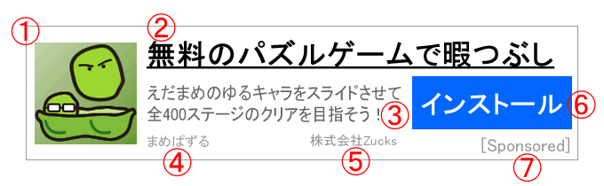

# Zucks Ad Network Native Ad API v2.0 Specification

## Request

* End point
  * `https://sh.zucks.net/opt/native/api/v2`
* Method
  * GET

### Request Headers

* `User-Agent` : Required.
  * 広告を表示する端末のデフォルトブラウザと同等のものをHeader、もしくは後述のParameter `ua` で必ず送信してください
  * 末尾に独自の付加情報が追加されていても、許容されます
  * Parameter `ua` が設定されている場合、Parameter側の設定が優先されます
* `Referer` : Optional.
  * Parameter `ref` が設定されている場合、Parameter側の設定が優先されます
* `Accept-Language` : Optional.
  * Parameter `lang` が設定されている場合、Parameter側の設定が優先されます
* `Origin` : Optional.
  * `withCredentials` 属性を `true` にてリクエストする場合は設定してください
* `Cookie` : Optional.

### Request Parameters

* `frameid` : Required.
  * 広告枠毎に発行されるFrame ID
  * Zucks Ad Network管理画面のメディア/広告枠管理ページよりご確認ください
* `ida` : Optional.
  * IDFA(iOS) or Advertising ID(Android)
* `lat` : Optional.
  * 「広告トラッキング制限」が無効な場合: `0`
  * 「広告トラッキング制限」が有効な場合: `1`
* `ip` : Optional.
  * Source IP address
  * APIへのリクエストをサーバから発行する場合など、広告を表示する端末のIPアドレスを設定してください
* `ua` : Optional.
  * Headerと異なるUser-Agentを利用する場合に設定してください
* `ref` : Optional.
  * Headerと異なるRefererを利用する場合に設定してください
* `lang` : Optional.
  * Headerと異なるAccept-Languageを利用する場合に設定してください

### その他

* ブラウザ/WebView内からのXMLHttpRequestを使ってリクエストを送る場合
  * `withCredentials` 属性を `true` にてリクエストしてください
  * `Request Headers` の `Origin` を設定してください


## Response

JSON文字列を返却します。文字コードはUTF-8となります。

### Response Body

#### 広告案件が存在する場合

* `status` : String
  * `ok`
* `type` : String
  * `native`
* `imp_url` : String
  * インプレッション計測用エンドポイント
* `image_src` : String
  * 広告画像URL
  * 縦横比を保って表示してください
* `width` : String
  * 広告画像の横幅
* `height` : String
  * 広告画像の高さ
* `title` : String
  * 広告タイトル
  * 全角1～44文字（半角1～88文字）の文字列
* `body_text` : String
  * 広告の本文
  * 全角1～44文字（半角1～88文字）の文字列
* `product_name` : String
  * サービス・商品名
  * 全角1～18文字（半角1～36文字）の文字列
* `advertiser_name` : String
  * 広告主名
  * 全角1～18文字（半角1～36文字）の文字列
* `link_button_text` : String
  * リンクボタン設置時のテキスト
  * 全角0～7文字（半角0～14文字）の文字列
* `landing_url` : String
  * 広告タップ時の遷移先URL

#### 広告案件が存在しない場合

* `status` : String
  * `no_ad`
* `imp_url` : String
  * 広告在庫切れ計測用エンドポイント

広告案件が存在しない場合でも、HTTPステータスコードは200で返却します。

`imp_url` 値を後述 Firing Impressions に従って処理することで、「配信する広告案件が存在しなかった」数としてカウントします。

### その他

レスポンス内容はキャッシュせずに、広告表示のタイミングで毎回APIを叩いて取得した結果を利用してください。

キャッシュした内容で広告表示を行うと正しく広告が表示されていないと判断され、インプレッション、クリックが正しくカウントされない場合があります。


## Example

### Request

```
https://sh.zucks.net/opt/native/api/v2?frameid=_xxxxxxxxxx&ida=xxxx-xxxx-xxxx-xxxx-xxxx&lat=0&ip=1.66.96.0&ua=Mozilla%2F5.0%20%28iPhone%3B%20CPU%20iPhone%20OS%2010_0%20like%20Mac%20OS%20X%29%20AppleWebKit%2F602.1.50%20%28KHTML%2C%20like%20Gecko%29%20Version%2F10.0%20Mobile%2F14A345%20Safari%2F602.1&ref=http%3A%2F%2Fexample.com&lang=ja
```

### Response

#### 広告案件が存在する場合

```json
{
    "status": "ok",
    "type": "native",
    "imp_url": "https:\u002F\u002Fk.zucks.net\u002F...",
    "image_src": "https:\u002F\u002Fstatic.zucks.net.zimg.jp\u002Fimage\u002F...",
    "width": "114",
    "height": "114",
    "title": "【ネイティブ広告のタイトル】",
    "body_text": "【ネイティブ広告の本文】",
    "product_name": "【サービス・商品名】",
    "advertiser_name": "【広告主名】",
    "link_button_text": "【リンクボタン設置時のテキスト】",
    "landing_url": "https:\u002F\u002Fk.zucks.net\u002F..."
}
```

#### 広告案件が存在しない場合

```json
{
    "status": "no_ad",
    "imp_url": "https:\u002F\u002Fk.zucks.net\u002F..."
}
```


## Rendering the Ad

`image_src` は、png/jpg/gif(アニメーション含む)などの画像ファイルを示すURLです。
このURLから画像を取得し、縦横比を保った状態で表示してください。
`image_src` の画像ファイルの内容は不変です。必要に応じてキャッシュして利用することができます。

`link_button_text` はリンクボタン設置時に利用することができるテキストです。
広告によっては空文字の場合があります。

広告表示時には広告であることを明記するスポンサーラベル（`Sponsored`、`AD`、`広告`など）を必ず表示してください。

### Rendering Sample

1. 広告画像（`image_src`）
2. タイトル（`title`）
3. 広告の本文（`body_text`）
4. サービス・商品名（`product_name`）
5. 広告主名（`advertiser_name`）
6. リンクボタン設置時のテキスト（`link_button_text`）
7. スポンサーラベル




## Firing Impressions

Zucks Ad Networkでは、ビーコン送信によりインプレッションをカウントしています。

各広告をレンダリングした直後、 `imp_url` のURLにGETリクエストを送信してください。

* End point
  * `imp_url` のURL
* Method
  * GET
* ブラウザ/WebView内からの XMLHttpRequest を使ってリクエストを送る場合
  * `withCredentials` 属性を `true` にてリクエストしてください

また、広告案件が存在しなかった場合も同様のリクエストを送信することで、「配信する広告案件が存在しなかった」数としてカウントします。


## Firing Clicks

広告タップ時、`landing_url` のURLをデフォルトブラウザで開いてください


## Check List

ご利用開始までに確認すべきチェック項目です

**広告収益の算出ができない場合がありますので、必ず確認してください**

- [ ] ネイティブ広告が表示された
- [ ] Zucks Ad Network管理画面で、インプレッション数が増えた
- [ ] クリック後、デフォルトブラウザでランディングページが表示された
- [ ] Zucks Ad Network管理画面で、クリック数が増えた


## Trouble Shooting

よくあるトラブルに対する確認項目です

### no_ad しか返却されません

- [ ] Request Parameterの `frameid` 値は正しいですか？
- [ ] Request Headerの `User-Agent` 値またはRequest Parameterの `ua` 値は、広告を表示する端末のデフォルトブラウザに準じた値ですか？

該当枠に対する広告在庫がない場合もございます。詳しくはお問い合わせください。

### インプレッションがカウントされません

- [ ] Request Parameterの `frameid` 値は正しいですか？
- [ ] `imp_url` 値のURLにリクエストを発行していますか？
- [ ] 管理画面上のレポーティングには多少のタイムラグがあります。しばらく時間をおいて確認してみてください。

### クリックがカウントされません

- [ ] `landing_url` 値のURLにリクエストを発行していますか？
- [ ] そのレスポンスは `302 Moved Temporarily` ですか？
- [ ] 管理画面上のレポーティングには多少のタイムラグがあります。しばらく時間をおいて確認してみてください。
